# Deciphering Handwritten Sentences in Images

 
 

# Introduction

The ability to decipher handwritten sentences within images presents a persistent challenge in computer vision. This report focuses on recognizing **handwritten words** within images displaying **single lines of text**. This task holds immense value in various domains, including optical character recognition, automated text extraction, and historical document preservation.

Using dataset of handwritten samples we explore machine learning methodologies, particularly neural networks, to accurately transcribe handwritten sentences from single-line image representations. This report aims to detail our analysis, network architectures employed, experiments conducted, and conclusions drawn from these investigations.

 
 

---

# Dataset

### Info
For the handwritten samples we will be using [IAM Handwritting Database](https://fki.tic.heia-fr.ch/databases/iam-handwriting-database). The IAM Handwriting Database contains handwritten English text which can be used to train and test handwritten text recognizers and to perform writer .identification and verification experiments.

The database contains forms of unconstrained handwritten text, which were scanned at a resolution of 300dpi and saved as PNG images with 256 gray levels. The figure below provides samples of a complete form, a text line and some extracted words.

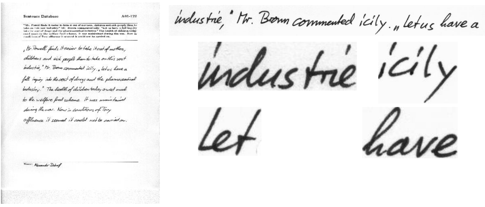

### Characteristics
The IAM Handwriting Database 3.0 is structured as follows:
- 657 writers contributed samples of their handwriting
- 1'539 pages of scanned text
- 5'685 isolated and labeled sentences
- 13'353 isolated and labeled text lines
- 115'320 isolated and labeled words

 
 

---

# Data analysis

The analysis is performed on the whole dataset and it consists
of the following:
- words per line statistics
- words length statistics
- most and least frequent words
- most and least frequent word pairs
- characters frequency
- frequency of the character pairs
  
### Words per line statistics

The distribution of words per line reveals a predominant trend—most sentences consist of around 8 words, following a normal distribution as can be seen in the image. The dataset contains sentences with a maximum length of 22 words and a minimum of one word. This analysis helps understand the variation in sentence structures and may impact how models handle differing sentence lengths during predictions.

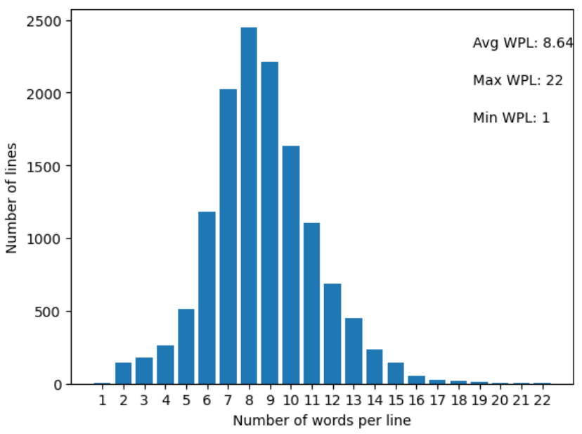

### Words length statistics

In assessing the model's capability to predict words of varying lengths, the revealed distribution—a departure from the anticipated normal distribution—provides valuable insights. The observed pattern, showing a somewhat decreasing order and emphasizing shorter word lengths, particularly the prominence of length 3 words, aligns with the linguistic reality. This deviation makes sense considering the prevalence of stopwords and shorter, common words in language, shedding light on the unique characteristics of textual data within the dataset. Unveiling these nuances informs us of potential challenges for the model to predict longer words.

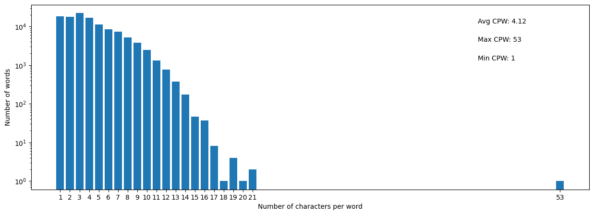

### Most and least frequent words

Examining the most and least frequent words serves a dual purpose. For the most frequent words, the analysis reveals that they largely consist of stopwords, aligning with linguistic expectations. This understanding is crucial as it informs the model about the prevalence of common language elements.

On the other hand, investigating the least frequent words raises considerations about potential challenges for the model. With fewer appearances in the dataset, these words may pose difficulties during prediction. An intriguing observation is that these less frequent words tend to carry a slightly negative connotation. This nuance adds a layer of complexity, prompting reflection on the potential impact of sentiment in the model's performance.

This analysis thus not only sheds light on the expected dominance of stopwords among the most frequent words but also introduces a noteworthy association between less frequent words and their connotations, posing interesting considerations for model training.

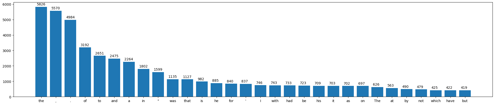

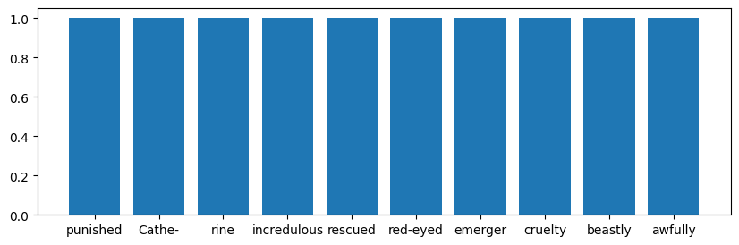

### Most and least frequent word pairs 

This analysis delves into the exploration of word pairs to discern potential patterns and understand the model's learning of short phrases within lines. Observing the most frequent word pairs highlights a prevalent presence of punctuation signs or stopwords, aligning with the expectation derived from the predominance of stopwords among individual words.

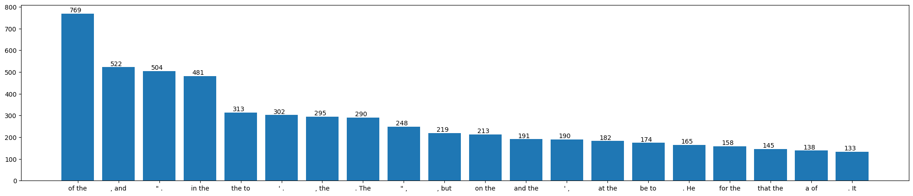

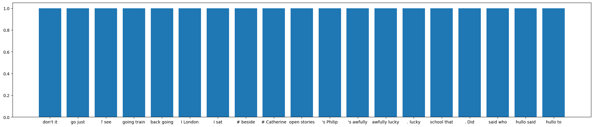

### Characters frequency

The examination of character frequency within the dataset reveals notable trends. Unsurprisingly, ``a``, ``e`` and ``t`` emerge as the most frequent characters, aligning with their prevalence in the English language.

Another observation is the limited presence of uppercase letters and punctuation signs. This aligns with the nature of the dataset, where sentences predominantly consist of lowercase letters. The absence of significant occurrences of uppercase and punctuation marks underlines the dataset's focus on handwritten text, offering insights into the stylistic and compositional characteristics of the provided lines.

Understanding these character frequency dynamics not only reaffirms the dominance of common letters but also provides a nuanced view of the linguistic features present in the dataset, contributing to the contextual understanding for subsequent model training.

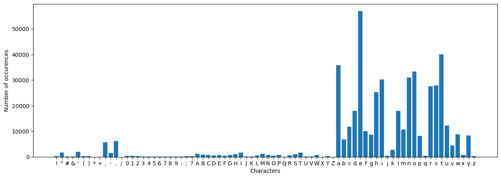

### Frequency of the character pairs

The visualization in the form of a heatmap matrix displaying the frequency of character pairs offers valuable insights into recurring patterns. Notably, the most frequent pairs are ``th`` and ``he`` reinforcing the observation that the word ``the`` is among the most frequent words in the dataset. This finding aligns with linguistic expectations.

Moreover, the heatmap illustrates the rarity of combinations involving uppercase letters or mixes of uppercase letters and numbers. This scarcity in certain character pairings resonates with the dataset's focus on handwritten text predominantly composed of lowercase letters, aligning with the stylistic conventions observed in the dataset.

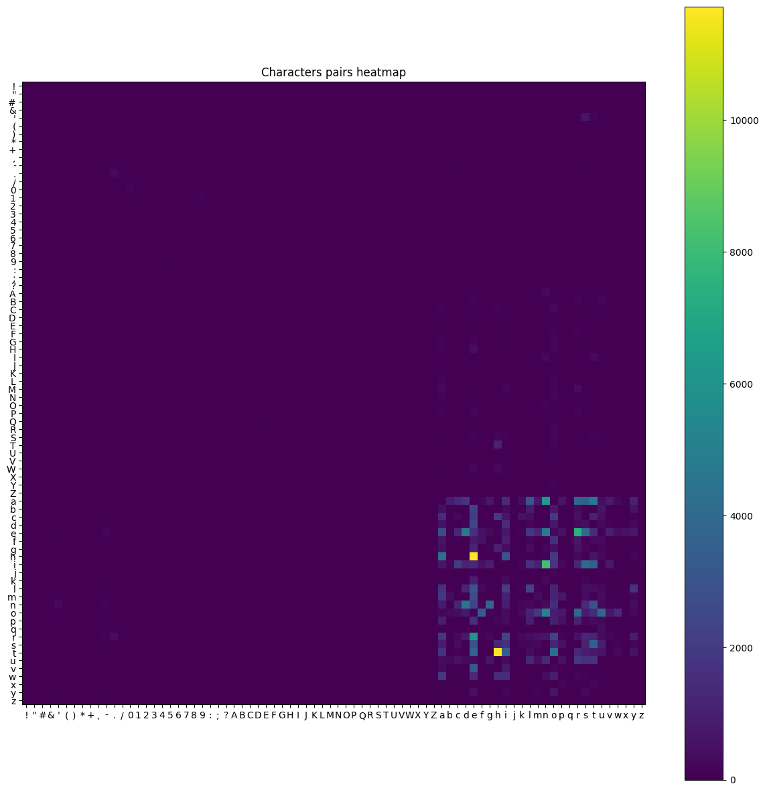

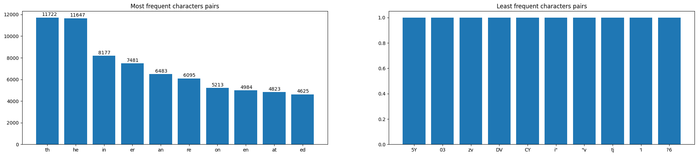

 
 
 

---

# Model Zoo

We used different approaches as we wanted to see outcome of the different network arcitectures.
Here we used:
- Combination of CNN (encoder) and RNN (decoder)
- Combination of the two transformers (one is encoder and one decoder)
- Decoupled attention network (Modular combination of two CNN and RNN)
  

### Combination of CNN (encoder) and RNN (decoder)

- for more details, please refer to the [paper](https://www.cs.uoi.gr/~sfikas/DAS2022-Retsinas-BestpracticesHTR.pdf)

This network uses `CNN` (**resnet** as a backbone) which serves as some kind of encoder, that will encode 'meaningful' information from the `2d` image into `1d` vector which will then be fed into RNN that will try decode that data into line of words. Apart from the CNN backbone, the recurrent head, we also depict the auxiliary CTC shortcut branch which will be the core component of the proposed training modification.

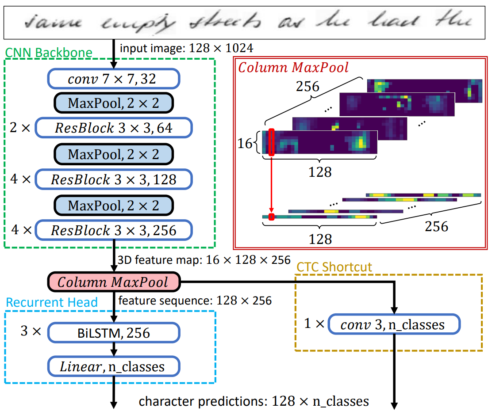

**So we mentioned CTC, but what it is?**

`CTC (Connectionist Temporal Classification)` in RNN (Recurrent Neural Networks) is a method used in training these networks to handle sequences where the length of input and output may differ. It helps in tasks like speech recognition or handwriting recognition by allowing the RNN to learn to align the input sequence with the output sequence, even when they're not of the same length.

In simple terms, `CTC` helps the RNN learn how to understand and recognize sequences of data, like spoken words or handwritten text, without needing a one-to-one match between input and output lengths. It's like teaching the RNN to figure out what someone is saying or writing, even if the words are of different lengths or spoken at different speeds.

    
     
    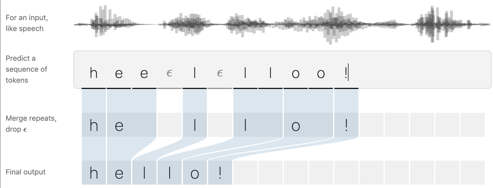

