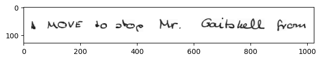
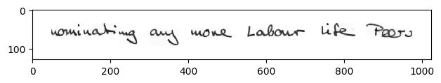
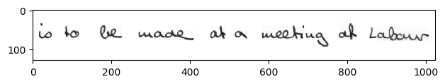
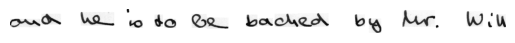
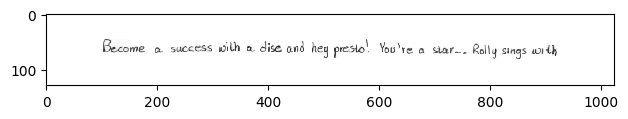
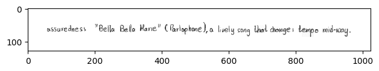
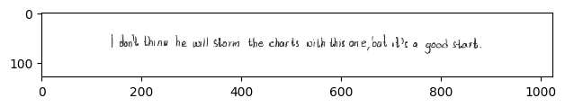
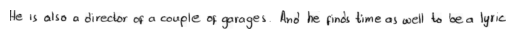
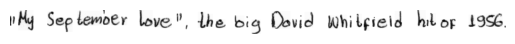

# Deciphering Handwritten Sentences in Images

 

# Table of Contents

- [Deciphering Handwritten Sentences in Images](#deciphering-handwritten-sentences-in-images)
- [Table of Contents](#table-of-contents)
- [Introduction](#introduction)
- [Dataset](#dataset)
    - [Info](#info)
    - [Characteristics](#characteristics)
- [Data analysis](#data-analysis)
    - [Words per line statistics](#words-per-line-statistics)
    - [Words length statistics](#words-length-statistics)
    - [Most and least frequent words](#most-and-least-frequent-words)
    - [Most and least frequent word pairs](#most-and-least-frequent-word-pairs)
    - [Characters frequency](#characters-frequency)
    - [Frequency of the character pairs](#frequency-of-the-character-pairs)
- [Model Zoo](#model-zoo)
    - [Combination of CNN (encoder) and RNN (decoder)](#combination-of-cnn-encoder-and-rnn-decoder)
  - [Combination of the two transformers (one is encoder and one decoder)](#combination-of-the-two-transformers-one-is-encoder-and-one-decoder)
  - [`D`ecoupled `A`ttention `N`etwork (CNN + CAM feed into RNN)](#decoupled-attention-network-cnn--cam-feed-into-rnn)
- [Training](#training)
    - [`CER` and `WER`](#cer-and-wer)
    - [`CER` (`C`haracter `E`rror `R`ate):](#cer-character-error-rate)
    - [`WER` (`W`ord `E`rror `R`ate)](#wer-word-error-rate)
    - [Training of **CNN-RNN** with the `CTC` shortcut](#training-of-cnn-rnn-with-the-ctc-shortcut)
    - [Training of **CNN-RNN** without the `CTC` shortcut](#training-of-cnn-rnn-without-the-ctc-shortcut)
    - [Training of **TrOCR** transformer based network](#training-of-trocr-transformer-based-network)
- [Evaluation](#evaluation)
  - [Training set](#training-set)
  - [Test set](#test-set)
- [Conclusion](#conclusion)

 

# Introduction

The ability to decipher handwritten sentences within images presents a persistent challenge in computer vision. This report focuses on recognizing **handwritten words** within images displaying **single lines of text**. This task holds immense value in various domains, including optical character recognition, automated text extraction, and historical document preservation.

Using dataset of handwritten samples we explore machine learning methodologies, particularly neural networks, to accurately transcribe handwritten sentences from single-line image representations. This report aims to detail our analysis, network architectures employed, experiments conducted, and conclusions drawn from these investigations.

 
 

---

# Dataset

### Info
For the handwritten samples we will be using [IAM Handwritting Database](https://fki.tic.heia-fr.ch/databases/iam-handwriting-database). The IAM Handwriting Database contains handwritten English text which can be used to train and test handwritten text recognizers and to perform writer .identification and verification experiments.

The database contains forms of unconstrained handwritten text, which were scanned at a resolution of 300dpi and saved as PNG images with 256 gray levels. The figure below provides samples of a complete form, a text line and some extracted words.

 

---

### Characteristics
The IAM Handwriting Database 3.0 is structured as follows:
- 657 writers contributed samples of their handwriting
- 1'539 pages of scanned text
- 5'685 isolated and labeled sentences
- 13'353 isolated and labeled text lines
- 115'320 isolated and labeled words

 
 

---

# Data analysis

The analysis is performed on the whole dataset and it consists
of the following:
- words per line statistics
- words length statistics
- most and least frequent words
- most and least frequent word pairs
- characters frequency
- frequency of the character pairs
  
 

---

### Words per line statistics

The distribution of words per line reveals a predominant trend—most sentences consist of around 8 words, following a normal distribution as can be seen in the image. The dataset contains sentences with a maximum length of 22 words and a minimum of one word. This analysis helps understand the variation in sentence structures and may impact how models handle differing sentence lengths during predictions.

 

---

### Words length statistics

In assessing the model's capability to predict words of varying lengths, the revealed distribution—a departure from the anticipated normal distribution—provides valuable insights. The observed pattern, showing a somewhat decreasing order and emphasizing shorter word lengths, particularly the prominence of length 3 words, aligns with the linguistic reality. This deviation makes sense considering the prevalence of stopwords and shorter, common words in language, shedding light on the unique characteristics of textual data within the dataset. Unveiling these nuances informs us of potential challenges for the model to predict longer words.

 

---
### Most and least frequent words

Examining the most and least frequent words serves a dual purpose. For the most frequent words, the analysis reveals that they largely consist of stopwords, aligning with linguistic expectations. This understanding is crucial as it informs the model about the prevalence of common language elements.

On the other hand, investigating the least frequent words raises considerations about potential challenges for the model. With fewer appearances in the dataset, these words may pose difficulties during prediction. An intriguing observation is that these less frequent words tend to carry a slightly negative connotation. This nuance adds a layer of complexity, prompting reflection on the potential impact of sentiment in the model's performance.

This analysis thus not only sheds light on the expected dominance of stopwords among the most frequent words but also introduces a noteworthy association between less frequent words and their connotations, posing interesting considerations for model training.

 

---
### Most and least frequent word pairs 

This analysis delves into the exploration of word pairs to discern potential patterns and understand the model's learning of short phrases within lines. Observing the most frequent word pairs highlights a prevalent presence of punctuation signs or stopwords, aligning with the expectation derived from the predominance of stopwords among individual words.

 

---
### Characters frequency

The examination of character frequency within the dataset reveals notable trends. Unsurprisingly, ``a``, ``e`` and ``t`` emerge as the most frequent characters, aligning with their prevalence in the English language.

Another observation is the limited presence of uppercase letters and punctuation signs. This aligns with the nature of the dataset, where sentences predominantly consist of lowercase letters. The absence of significant occurrences of uppercase and punctuation marks underlines the dataset's focus on handwritten text, offering insights into the stylistic and compositional characteristics of the provided lines.

Understanding these character frequency dynamics not only reaffirms the dominance of common letters but also provides a nuanced view of the linguistic features present in the dataset, contributing to the contextual understanding for subsequent model training.

 

---

### Frequency of the character pairs

The visualization in the form of a heatmap matrix displaying the frequency of character pairs offers valuable insights into recurring patterns. Notably, the most frequent pairs are ``th`` and ``he`` reinforcing the observation that the word ``the`` is among the most frequent words in the dataset. This finding aligns with linguistic expectations.

Moreover, the heatmap illustrates the rarity of combinations involving uppercase letters or mixes of uppercase letters and numbers. This scarcity in certain character pairings resonates with the dataset's focus on handwritten text predominantly composed of lowercase letters, aligning with the stylistic conventions observed in the dataset.

 
 
 

---

# Model Zoo

We used different approaches as we wanted to see outcome of the different network arcitectures.
Here we used:
- Combination of **CNN** (encoder) and **RNN** (decoder)
- Combination of the two **transformers** (one is encoder and one decoder)
- Decoupled Attention Network (**CNN** + **CAM** feed into **RNN**)
  
---

### Combination of CNN (encoder) and RNN (decoder)

- for more details, please refer to the [paper](https://www.cs.uoi.gr/~sfikas/DAS2022-Retsinas-BestpracticesHTR.pdf)

This network uses `CNN` (**resnet** as a backbone) which serves as some kind of encoder, that will encode 'meaningful' information from the `2d` image into `1d` vector which will then be fed into RNN that will try decode that data into line of words. Apart from the CNN backbone, the recurrent head, we also depict the auxiliary CTC shortcut branch which will be the core component of the proposed training modification.

 

--- 
**So we mentioned CTC, but what it is?**

`CTC (Connectionist Temporal Classification)` in RNN (Recurrent Neural Networks) is a method used in training these networks to handle sequences where the length of input and output may differ. It helps in tasks like speech recognition or handwriting recognition by allowing the RNN to learn to align the input sequence with the output sequence, even when they're not of the same length.

In simple terms, `CTC` helps the RNN learn how to understand and recognize sequences of data, like spoken words or handwritten text, without needing a one-to-one match between input and output lengths. It's like teaching the RNN to figure out what someone is saying or writing, even if the words are of different lengths or spoken at different speeds.

    
     
    

 

--- 

## Combination of the two transformers (one is encoder and one decoder)

- for more details, please refer to the [paper](https://arxiv.org/pdf/2109.10282.pdf)

Fine-tuning a pre-trained TrOCR model on the [IAM Handwriting Database](https://fki.tic.heia-fr.ch/databases/iam-handwriting-database), a collection of annotated images of handwritten text.

Using the new `VisionEncoderDecoderModel` class, which can be used to combine any image Transformer encoder (such as ViT, BEiT) with any text Transformer as decoder (such as BERT, RoBERTa, GPT-2). TrOCR is an instance of this, as it has an encoder-decoder architecture, with the weights of the encoder initialized from a pre-trained BEiT, and the weights of the decoder initialized from a pre-trained RoBERTa. The weights of the cross-attention layer were randomly initialized, before the authors pre-trained the model further on millions of (partially synthetic) annotated images of handwritten text.

    

 

--- 

## `D`ecoupled `A`ttention `N`etwork (CNN + CAM feed into RNN)

- for more details, please refer to the [paper](https://arxiv.org/pdf/1912.10205.pdf)

The proposed **DAN** aims at solving the misalignment issue
of traditional attention mechanism through decoupling the
alignment operation from using historical decoding results.
In the paper, they proposed a new convolutional alignment
module (`CAM`) together with a decoupled text decoder to
replace the traditional decoder. The overall architecture of
**DAN** is illustrated here.

The input of proposed `CAM` is visual features of each scale from the feature encoder. These
multi-scale features are first encoded by cascade downsampling convolutional layers then summarized as input. Inspired by the **FCN** (Fully Convolutional Network) that makes dense predictions per-pixel
channel-wise (i.e. each channel denotes a heatmap of a
class), they use a simple **FCN** architecture to conduct the attention operation channel-wise, which is quite different from
current attention mechanism. The `CAM` has **L** layers; in the
*deconvolution stage*, each output feature is added with the
corresponding feature map from *convolution stage*.

    

 

--- 

# Training

In the following section we will describe how the training went for different architectures, but before that, we will first introduce the metrics used to evaluate our models.

--- 
### `CER` and `WER`

### `CER` (`C`haracter `E`rror `R`ate): 
`CER` measures the percentage of incorrectly recognized characters compared to the total number of characters in the ground truth (actual) text. It quantifies the accuracy of individual characters, irrespective of word boundaries. `CER` is calculated by considering substitutions (incorrect characters), insertions (additional characters), and deletions (missing characters) necessary to align the recognized text with the ground truth, and then dividing this count by the total number of characters in the ground truth.

    

### `WER` (`W`ord `E`rror `R`ate)
`WER` measures the percentage of incorrectly recognized words relative to the total number of words in the ground truth text. It evaluates the accuracy of complete words, accounting for substitutions (incorrect words), insertions (extra words), and deletions (missing words) required to align the recognized text with the ground truth. `WER` is calculated by considering these operations and dividing the count by the total number of words in the ground truth.

    

Both `CER` and `WER` are valuable metrics in **HCR** (**H**andwritten **C**haracter **R**ecognition) tasks, offering insights into the accuracy of character and word recognition, respectively. Lower `CER` and `WER` values indicate higher accuracy in the HCR system's performance.

    

--- 

Now when we are done with metrics introduction we can see how our models performed during training:
- Training of **CNN-RNN** with the `CTC` shortcut
- Training of **CNN-RNN** without the `CTC` shortcut
- Training of **TrOCR** transformer based network
 

--- 

### Training of **CNN-RNN** with the `CTC` shortcut

In this training session we used early stopping with patience 3 and it stopped training after *31* epochs.

    

 

`CER` and `WER` were following:

<table>
    
CER scores during training

  <tr>
    <td> 
CER for the CTC shortcut
</td>
    <td> 
CER for the RNN
</td>
  </tr>
<table>

<table>
    
WER scores during training

  <tr>
    <td> 
WER for the CTC shortcut
</td>
    <td> 
WER for the RNN
</td>
  </tr>
<table>

 
And the configuration of the network was as following:

| Parameter       | Value         |
|-----------------|---------------|
| `k`             | 1             |
| `cnn_cfg`       | [(2, 64), 'M', (4, 128), 'M', (4, 256)] |
| `head_cfg`      | (256, 3)      |
| `head_type`     | 'both'        |
| `flattening`    | 'maxpool'     |
| `fixed_size`    | (128, 1024)   |
| `stn`           | False         |
| `max_epochs`    | 140           |
| `batch_size`    | 10            |
| `early_stopping`| 3             |

 

---
### Training of **CNN-RNN** without the `CTC` shortcut

In this training session we used early stopping with patience 3 and it stopped training after *32* epochs, which is only one epoch more than the previous training.

    

 

`CER` and `WER` were following:

<table>
  <tr>
    <td> 
CER score
</td>
    <td> 
WER score
</td>
  </tr>
<table>

 
And the configuration of the network was as following:

| Parameter       | Value            |
|-----------------|------------------|
| `k`             | 1                |
| `cnn_cfg`       | [(2, 64), 'M', (4, 128), 'M', (4, 256)] |
| `head_cfg`      | (256, 3)         |
| `head_type`     | 'rnn'            |
| `flattening`    | 'maxpool'        |
| `fixed_size`    | (128, 1024)      |
| `stn`           | False            |
| `max_epochs`    | 140              |
| `batch_size`    | 10               |
| `early_stopping`| 3                |

 

---
### Training of **TrOCR** transformer based network

Because this model consists of two large pretrained transformers (`BEiT` and `RoBERTa`), we only trained it on the portion of the dataset, and only for *5* epochs. And this is how the training went: 

    

 

`CER` and `WER` were following:

<table>
  <tr>
    <td> 
CER score
</td>
    <td> 
WER score
</td>
  </tr>
<table>

# Evaluation
## Training set

As we can see from the tables bellow, first two models (**CNN-RNN**) who were trained from 
scratch managed to learn to predict text based on image in all *3* instances. **TrOCR** wasn't
that good even on the train set, but it can be backed by the fact that we trained it only for
*5* epochs, and training dataset was ~3 times smaller that the one used for **CNN-RNN** networks.

It's interesting that **TrOCR**'s errors consistently resulted in valid words rather than random characters. This aligns with its utilization of a pre-trained transformer language model. This behavior demonstrates the strength of the model, as its mistakes align with existing words, indicating its adherence to linguistic patterns learned during pre-training. It's common for language models to 'hallucinate' or generate sensible, yet incorrect, outputs based on learned linguistic patterns. This tendency towards valid word errors underlines the model's proficiency in generating contextually relevant outputs, even when incorrect.
 
  

| Model | prediction |
|---------------|---------|
| **CNN-RNN** with the `CTC` shortcut | A MOVE to stop Mr. Gaitskell from |
| **CNN-RNN** without the `CTC` shortcut | A MOVE to stop Mr. Gaitskell from |
| Ground Truth | A MOVE to stop Mr. Gaitskell from |

 

| Model | prediction |
|---------------|---------|
| **CNN-RNN** with the `CTC` shortcut | nominating any more Labour life Peers |
| **CNN-RNN** without the `CTC` shortcut | nominating any more Labour life Peers |
| Ground Truth | nominating any more Labour life Peers |

 

| Model | prediction |
|---------------|---------|
| **CNN-RNN** with the `CTC` shortcut | is to be made at a meeting of Labour |
| **CNN-RNN** without the `CTC` shortcut | is to be made at a meeting of Labour |
| **TrOCR**| is be made at a meeting of Labour |
| Ground Truth | is to be made at a meeting of Labour |

 

| Model | prediction |
|---------------|---------|
| **TrOCR**| and he is to be backed by Mr. Will |
| Ground Truth | and he is to be backed by Mr. Will |

 

| Model | prediction |
|---------------|---------|
| **TrOCR**| any were Labour life her is to be a week at a |
| Ground Truth | any more Labour life Peers is to be made at a |

 

---

## Test set

As expected, all three models exhibit decreased performance on the test set. However, it's noteworthy that **TrOCR**, when making mistakes, consistently outputs valid words, albeit in the wrong context."

 

| Model | prediction |
|---------------|---------|
| **CNN-RNN** with the `CTC` shortcut | Become a successwill a dise and hey presld ! You're a slari. Raly singswith |
| **CNN-RNN** without the `CTC` shortcut | Become a suceswith a dise and hey pres . You're a star. . Ralysmg with |
| Ground Truth | Become a success with a disc and hey presto ! You're a star ... . Rolly sings with |

 

| Model | prediction |
|---------------|---------|
| **CNN-RNN** with the `CTC` shortcut | assurechess " Della Bell Hare " ( Partlpton ) a Ively song that hronges tempo midmay . |
| **CNN-RNN** without the `CTC` shortcut | assurethess " Belle Bela tane " ( Parlophane ) a Wvely song thal chonges tempo mitway . |
| **TrOCR**| workers'But " that " ( One " Company's baby today today today, but they temporary. |
| Ground Truth | assuredness " Bella Bella Marie " ( Parlophone ) , a lively song that changes tempo mid-way . |

 

| Model | prediction |
|---------------|---------|
| **CNN-RNN** with the `CTC` shortcut | I dot thinn he cull slorm the charls witl this on , balils a good slark . |
| **CNN-RNN** without the `CTC` shortcut | I donit thinw he will slorm the charls wilth his on , pal i t's a good start . |
| Ground Truth | I don't think he will storm the charts with this one , but it's a good start . |

 

| Model | prediction |
|---------------|---------|
| **TrOCR**| He also struck a couples. has been to bea |
| Ground Truth | He is also a director of a couple of garages. And he finds time as well to be a lyric |

 

| Model | prediction |
|---------------|---------|
| **TrOCR**| the " September here ', he is " big subjected who was 1959. |
| Ground Truth | My September Love, " the big David Whitfield hit of 1956. |

 

---

# Conclusion

In this report, we tackled the challenge of deciphering handwritten sentences in images using machine learning. Analysis of the [IAM Handwriting Database](https://fki.tic.heia-fr.ch/databases/iam-handwriting-database) unveiled linguistic nuances, from common words to character frequencies.

We explored diverse network architectures, each offering unique insights. The **CNN-RNN** combo excelled consistently in learning to predict text. **TrOCR**, despite a smaller dataset, generated valid words, albeit in incorrect contexts, showcasing typical language model behavior.

During evaluation, all models showed decreased performance on the test set. However, **TrOCR**'s ability to consistently output valid words, even when wrong, highlights the strength of language models.

In conclusion, this study not only revealed dataset characteristics but also demonstrated language models' capability to generate contextually relevant outputs, even in error.